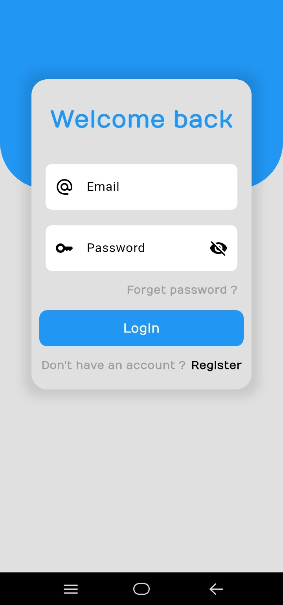
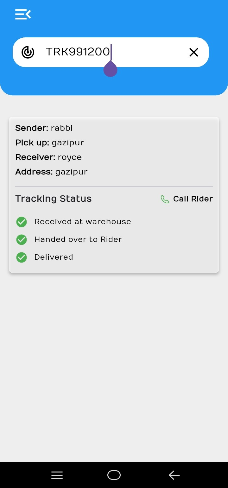
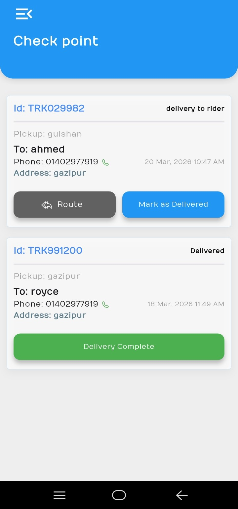
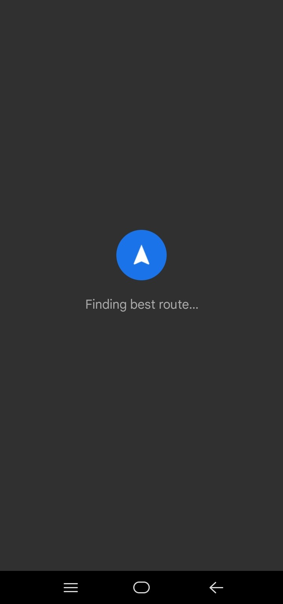
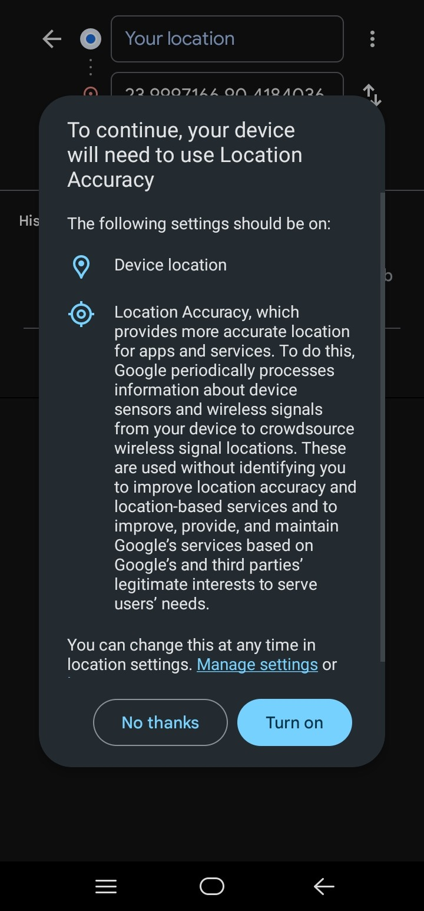

# Parcel Delivery Flutter App
A complete Parcel Delivery Mobile Application built with Flutter,Animations & Firebase.

This app allows users to send parcels, track deliveries, and manage orders efficiently with a clean and user-friendly interface.

# Screenshots

# Demo Video
YouTube:  https://youtu.be/PXeIk4BRR0Q?si=HHk3cbUiZfEyjNJ3

# Features
User Authentication (Login / Register)

Parcel Booking System

Delivery Tracking

Rider Assignment

Order History

Real-time Updates (Firebase)

Clean & Responsive UI

Status Update System (Pending, Picked, Delivered)

# Tech Stack
Flutter

Dart

Firebase Authentication

Cloud Firestore

GetX (State Management)

Google Fonts

# Author
**Rabby Khan**

Flutter Developer

# ⭐ Show Your Support
If you like this project, please give it a ⭐ on GitHub!
